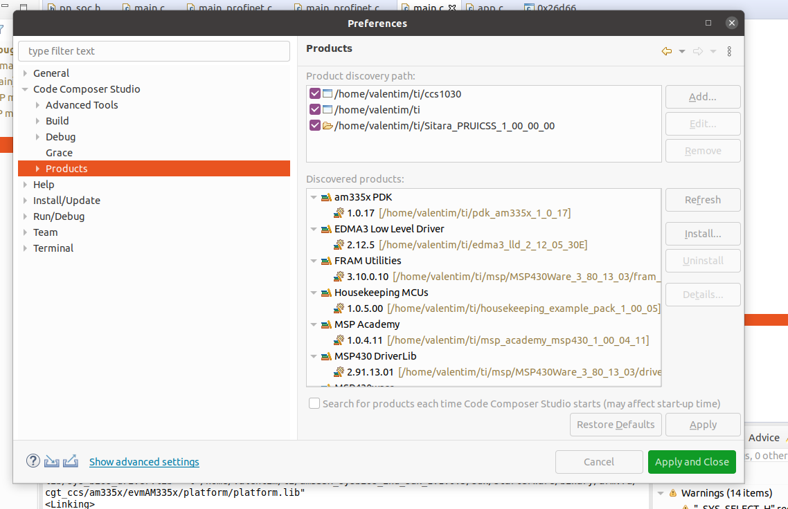
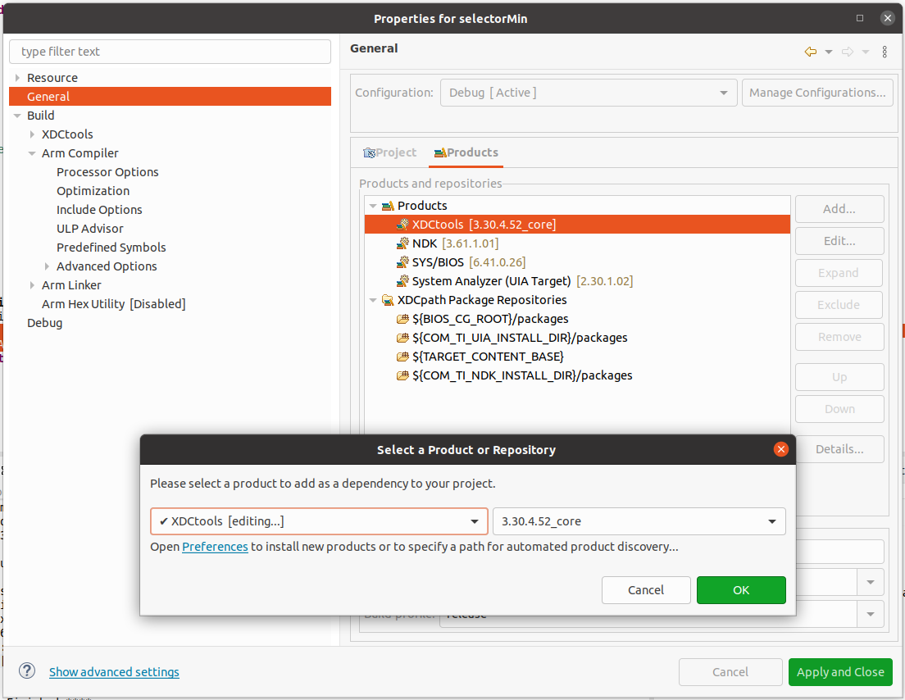
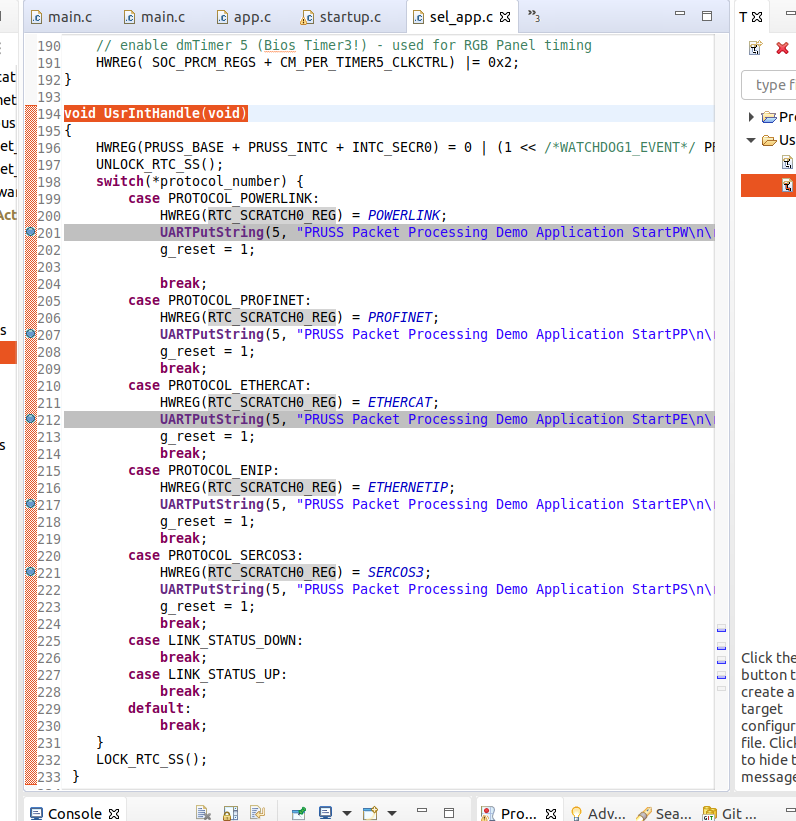

# iMultComP

## Automatic protocol detection

- In this section is a project (texas TIDEP0032) that automatically detects the protocol when the network cable is connected. The objective of this project is to detect the protocol, to record in a non-volatile memory a certain value depending on the detected protocol. The value inserted in the non-volatile memory can be used to reset the CPU and then start the program in the memory zone of the respective protocol. It is a dynamic way to start the board automatically according to the protocol  

- [Link to the demo video](https://www.youtube.com/watch?v=4IExPr1a1yQ&ab_channel=TexasInstruments)

- The "detection_firmware" project is for the PRU and the "selectorMin" project is for the ARM. The purpose of this "detection_firmware" project is to generate the binary and convert it into a .h file and then insert it into the "selectorMin" project. If you want to use this project just import the project "selectorMin" to CCStudio because the binary of the project "detection_firmware" is already inserted, only if you want to make changes to the PRU project.

## Get Start  

- I will demonstrate step by step how to start the SelectorMin project through CCStudio as well as giving a brief summary of how this project works. It is recommended to use the LINUX operating system to develop applications based on the GCC compiler.

- To be able to compile or change the project in CCStudio it is necessary to have some packages in the described versions. The packages listed below can be found on the texas website and must be installed in the folder where CCStudio is located. For example in the `/home/user_name/ti` folder or else in the`c:\`folder.
    . XDCtools 3.30.4.52_core
    . NDK 3.61.1.01 
    . SYS/BIOS 6.41.0.26

### 

- The first step is to open the code composer studio, go to the Project tab and then choose Import Project CCS. Click on the Browser button and go to the folder where is the project, select the project and click IMPORT. The project will appear on the left bar of the IDE. 

- To be able to compile, it is necessary to install previously downloaded packages in CCStudio. Click on the CCStudio Window tab and select the Preferences option. A window will appear as in the following figure.
- Select the Code Composer Studio tab and click on Products, as the following figure shows.

- Then click Refresh and then Install. When you clicked Refresh and the packages previously added in the `ti` folder do not appear, it means that you have installed the packages in the wrong folder. After the previous steps have been successfully completed, click Apply and Close and restart CCStudio.

- Now it is necessary to go to the project properties and ensure that the packages are selected with the correct version. In the project, click the right mouse button and select properties. In the options tree, click on General as shown in the following figure.

- As you can see, the products (XDCtools, NDK, SYSY / BIOS) are selected with the correct version. If in your example they have other versions, double-click on the selected product and choose the same version as the previous figure. Click on apply and the project will be ready to be compiled. 

## Protocol detection 

- I will demonstrate how to automatically detect a protocol. By default, each industrial protocol has a Header value that identifies the protocol. It is with this value that the PRU detects which protocol is connected to the board. When starting the project and connecting the RJ45 cable to an input on the AM3359 board, the RTC_SCRATCH0_REG register receives a certain value depending on the protocol, restarting the CPU so that at the next boot, load the project corresponding to the detected industrial protocol into to the RAM.

- To check if the protocol is being detected, Load the project to the board through CCStudio and add breakPoint in the UsrIntHandle () function, as shown in the following figure.

  

- Then start the project and connect the RJ45 cable and check the break point reached.

### work to be continued 
- Develop a bootloader project capable of loading the binary into RAM depending on the registry value RTC_SCRATCH0_REG. 
