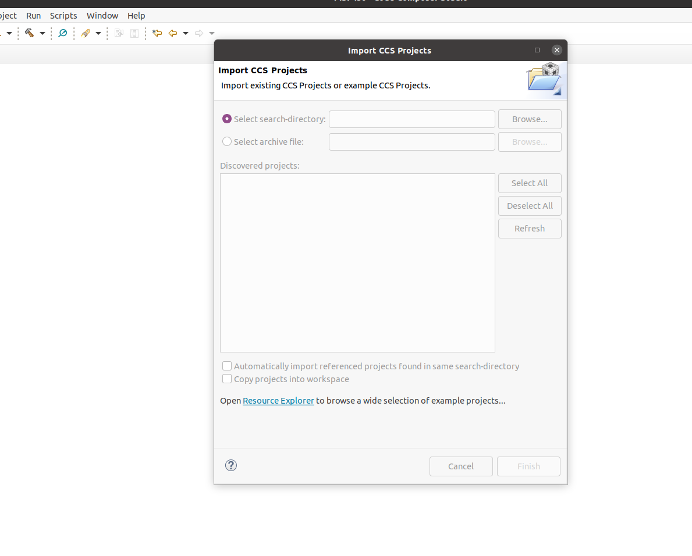
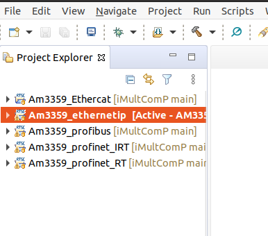
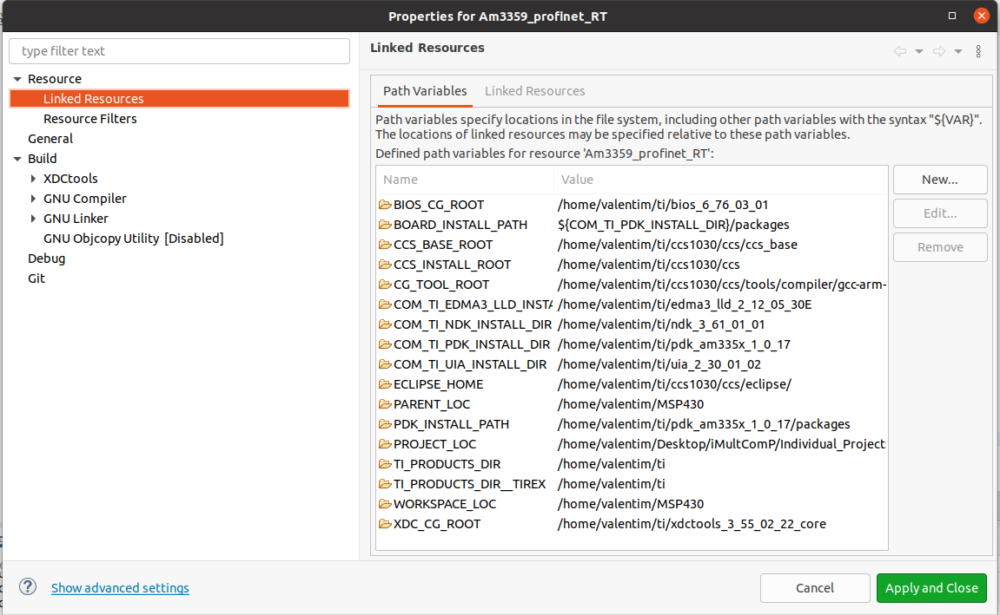

# iMultComP

## Get started 

- This section provides the source code for each protocol. I will demonstrate how to upload the respective protocol to the AM3359 board through CCStudio. It is necessary to have Code composer studio installed as well as SDK_TI_RTOS_AM335x. Install the CCStudio SDK in `c:\` on windows or in the `/home/user_name/ti` folder on Linux.
- Note: The tutorial is based on the Linux operating system. At the end of the section I will demonstrate the necessary step to compile the project on the Windows operating system. 

### Steps

- Clone this repository to your computer

- Open CCStudio and then click on the Project tab -> Import CCS project. The next window will appear. 

- The next step is to click on "browser" and point to the folder where the cloned project. Choose which project to import and click import. Then the project will appear in the left bar of CCStudio

- You may need to adjust project paths depending on your computer. Click with the button on the right side of the mouse and go to the properties. Then check the paths of the folders and change them to be correct with your computer.The following image gives the example. 

