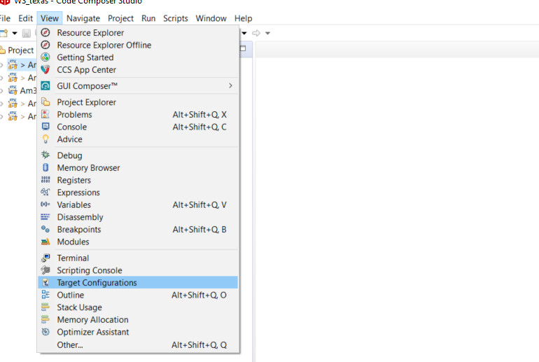
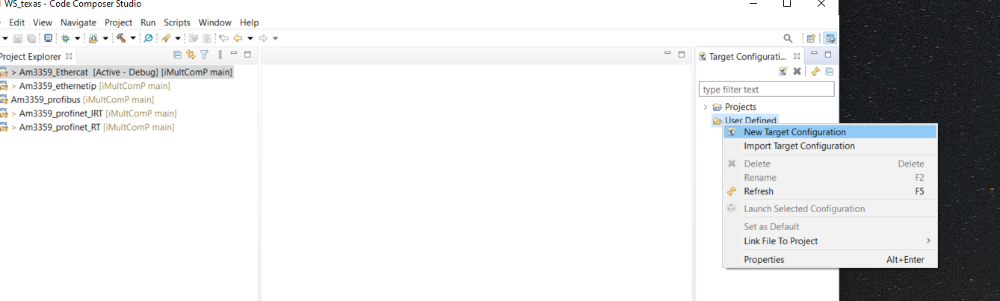
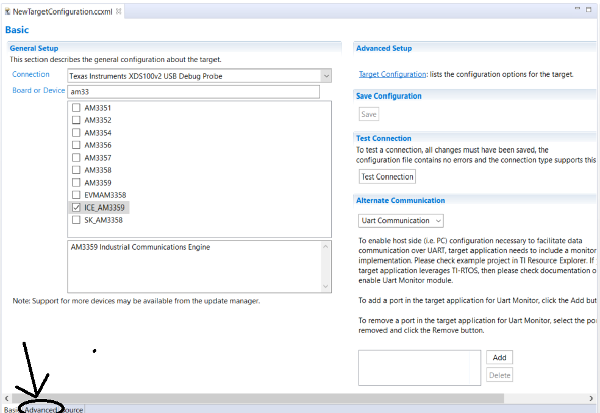
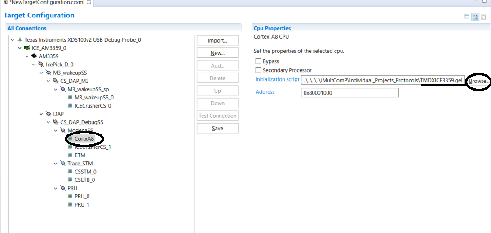
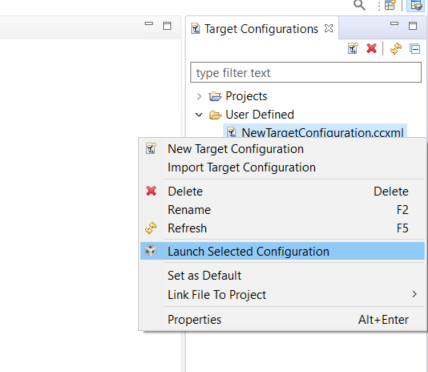
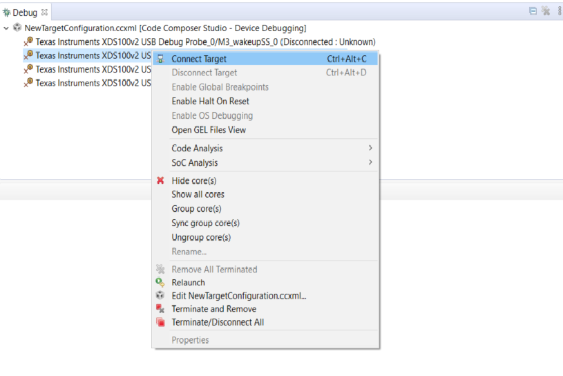
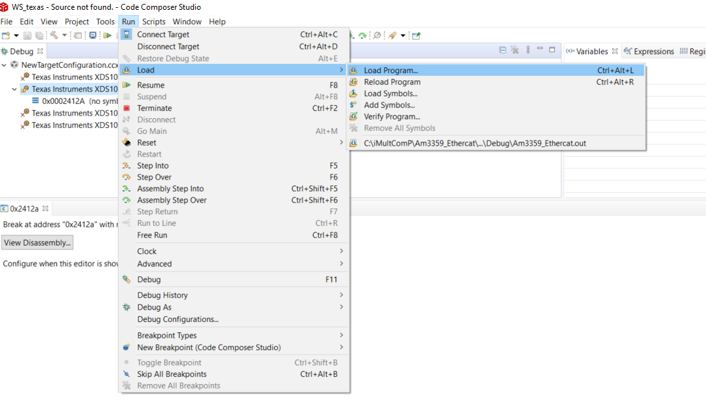
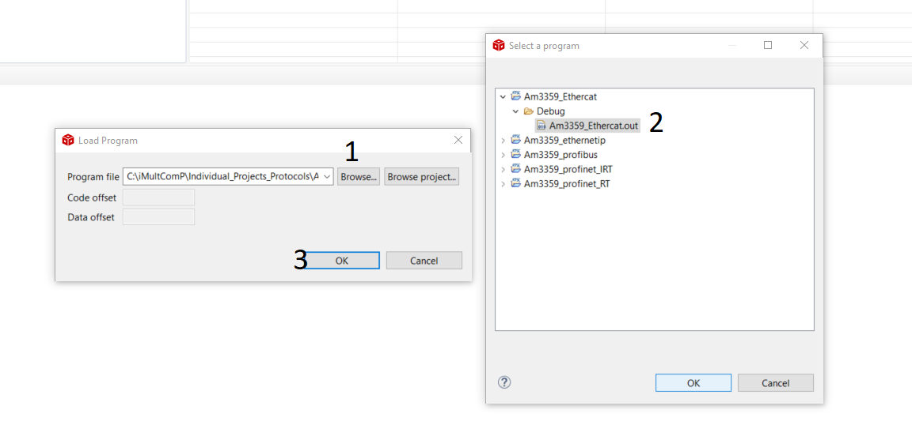

# iMultComP

## Get started 

- This section provides the source code for each protocol. I will demonstrate how to upload the respective protocol to the AM3359 board through CCStudio. It is necessary to have Code composer studio installed as well as SDK_TI_RTOS_AM335x. Install the CCStudio SDK in `c:\` on windows or in the `/home/user_name/ti` folder on Linux.

### Steps

- Clone this repository to your computer

- Open CCStudio and then click on the Project tab -> Import CCS project. The next window will appear. 

- The next step is to click on "browser" and point to the folder where the cloned project. Choose which project to import and click import. Then the project will appear in the left bar of CCStudio

- You may need to adjust project paths depending on your computer. Click with the button on the right side of the mouse and go to the properties. Then check the paths of the folders and change them to be correct with your computer.The following image gives the example.
- It is usually necessary to rename the path of the `PDK_INSTALL_PATH` folder, note that it is a component that is installed when TI_RTOS_AM335x is installed. 
- Still in the project properties, check the Build -> Steps tab to see if there is anything in the `Pos-build steps` field. Depending on the project, it may or may not exist. If it exists, check if the script (`${TI_PDK_INSTALL_DIR}/packages/pdkAppImageCreate.sh`) to be called is in accordance with your operating system. If you use Linux change to `.sh`, if you use windows change to `.bat`.

- Right-click on the project and select `Rebuild Project`, you should now recompile successfully. 

#### In the next steps I will explain how to configure the initialization of the peripherals of the board 

- If you haven't created it yet, create a targetConfiguration with the board's definitions. In CCStudio, click View -> TargetConfiguration, as shown in the following figure. 

- Next, create a new TargetConfiguration, and click finish.

- Select the options according to the board, click save and if the board is connected to the PC you can do the test by clicking on the test button. 
- Then click on Advanced to import the file `TMDXICE3359.gel` which contains the initialization information of the board. 
The .gel file is located in this github folder.

- In the advanced options select Core `CortxA8` and in the `initialization script` field point to the .gel file and click save. Finally, you can close the "targetConfiguration" tab. 

#### In the next steps I will explain how to load the binary onto the board

- Select the created `target Configuration` file and click Launch Selected Configuration. 

- Select Arm CortxA8 and click Connect Target to load the .gel file to the board.

- Then load the binary onto the board. 

- When finished loading click on F8 to start the project. 

